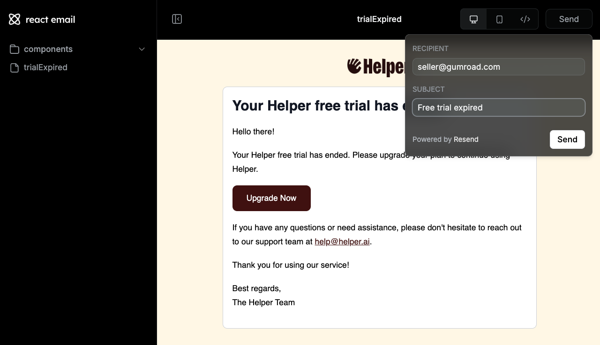

# Local Development Guide

## Dependencies

First, install local Certificate Authority:

```sh
# Install mkcert on macOS
brew install mkcert
brew install nss
```

_For other operating systems, see the [mkcert installation guide](https://github.com/FiloSottile/mkcert?tab=readme-ov-file#installation)._

Then, create a local Certificate Authority and generate SSL certificates for the Helper development project:

```sh
# Generate SSL certificates
bin/generate_ssl_certificates
```

## Environment & Services

Copy `apps/nextjs/.env.local.sample` to `apps/nextjs/.env.local`.

<details>
<summary>Clerk</summary>

1. Go to [clerk.com](https://clerk.com) and create a new app.
1. Name the app and set login methods to: **Email, Google, Apple, GitHub**.
1. Under "Configure > Email, phone, username", turn on "Personal information > Name"
1. Under "Configure > Organization Management", turn on "Enable organizations"
1. Under "Configure > API Keys", add `CLERK_SECRET_KEY` and `NEXT_PUBLIC_CLERK_PUBLISHABLE_KEY` to your `.env.local` file.
1. Under "Users", create a user with email `support@gumroad.com` and password `password`. Optionally create other users, e.g. with your email.
1. Add the user ID(s) to your `.env.local` file as `CLERK_INITIAL_USER_IDS`.
1. Under "Organizations", create a new organization and add your user(s) to the "Members" list.
1. Add the organization ID to your `.env.local` file as `CLERK_INITIAL_ORGANIZATION_ID`.

</details>

<details>
<summary>OpenAI</summary>

1. Create an account at [openai.com](https://openai.com).
1. Create a new API key at [platform.openai.com/api-keys](https://platform.openai.com/api-keys).
1. Add the API key to your `.env.local` file as `OPENAI_API_KEY`.

</details>

<details>
<summary>Ably</summary>

1. Go to [ably.com](https://ably.com) and sign up or log in.
2. Create a new app.
3. Go to the "API Keys" tab for your new app.
4. Copy the API key that has all capabilities enabled (usually the first one).
5. Add the API key to your `.env.local` file as `ABLY_API_KEY`.

</details>

_The app will start with placeholder values for Google services and Resend, but set these up if you want to test sending and receiving emails._

<details>
<summary>Resend (transactional emails)</summary>

1. Go to [resend.com](https://resend.com) and sign up or log in.
2. Navigate to "API Keys".
3. Click "Create API Key". Give it a name (e.g., "Helper Dev") and grant it "Sending access" permission.
4. Add the API key to your `.env.local` file as `RESEND_API_KEY`.

</details>

<details>
<summary>Google OAuth (sending via Gmail)</summary>

1. Go to the [Google Cloud Console](https://console.cloud.google.com/).
2. Create a new project or select an existing one.
3. Navigate to "APIs & Services" > "Credentials".
4. Click "Create Credentials" and select "OAuth client ID".
5. Choose "Web application" as the application type.
6. Add `https://helperai.dev/api/connect/google/callback` to the "Authorized redirect URIs".
7. Click "Create". You will be shown the Client ID and Client Secret.
8. Add these values to your `.env.local` file as `GOOGLE_CLIENT_ID` and `GOOGLE_CLIENT_SECRET`.
9. Navigate to "APIs & Services" > "Library".
10. Search for "Gmail API" and enable it for your project.
11. Navigate to "APIs & Services" > "OAuth consent screen".
12. Configure the consent screen. Under "Data access", add the `.../auth/gmail.send` scope.
13. Add your Google account email address as a Test User under "Audience" while the app is in testing mode.

</details>

<details>
<summary>Google Pub/Sub (receiving from Gmail)</summary>

_This setup allows the app to receive real-time notifications (e.g., new emails) from Gmail during local development._

**1.** Set up and start [Serveo](https://serveo.net), [ngrok](https://ngrok.com/docs/getting-started) or similar to get a public forwarding URL pointing to `localhost:3010`.

**2.** Set up Google Pub/Sub:

- Go to the [Google Cloud Console](https://console.cloud.google.com/) and select the same project used for Google OAuth.
- Navigate to "Pub/Sub" > "Topics".
- Click "Create Topic". Give it a name (e.g., `helper-email-dev`) and click "Create".
- Add the topic name to your `.env.local` file as `GOOGLE_PUBSUB_TOPIC_NAME`.
- Grant the Gmail service account permission to publish to this topic:
  - Go back to the "Topics" list and check the box next to your new topic.
  - Click "Permissions" in the info panel on the right (or click the topic name and go to the Permissions tab).
  - Click "Add Principal".
  - In the "New principals" field, enter `gmail-api-push@system.gserviceaccount.com`.
  - Assign the role "Pub/Sub Publisher".
  - Click "Save".
- Create a service account for the push subscription authentication:
  - Go to "IAM & Admin" > "Service Accounts".
  - Click "Create Service Account".
  - Give it a name (e.g., `pubsub-push-auth-dev`) and an ID. Click "Create and Continue".
  - Grant the service account the "Service Account Token Creator" role (`roles/iam.serviceAccountTokenCreator`). This allows it to generate OIDC tokens for authentication. Click "Continue" and "Done".
  - Add the service account email (e.g., `pubsub-push-auth-dev@<your-project-id>.iam.gserviceaccount.com`) to your `.env.local` file as `GOOGLE_PUBSUB_CLAIM_EMAIL`
- Create the push subscription:
  - Navigate to "Pub/Sub" > "Subscriptions".
  - Click "Create Subscription".
  - Give it an ID (e.g., `helper-email-subscription-dev`).
  - Select the Pub/Sub topic you created earlier (e.g., `helper-email-dev`).
  - Under "Delivery type", select "Push".
  - In the "Endpoint URL" field, enter your forwarding URL followed by the webhook path: `https://<your-forwarding-url>/api/webhooks/gmail` (replace `<your-forwarding-url>` with the URL from step 1).
  - Check the box for "Enable authentication".
  - Select the service account you just created (e.g., `pubsub-push-auth-dev@<your-project-id>.iam.gserviceaccount.com`).
  - Leave other settings as default and click "Create".

Now linking your Gmail account from Settings → Integrations should grant Gmail access and webhooks for new emails should arrive on your local server.

</details>

## Running locally

Run the application and access it at [helperai.dev](https://helperai.dev):

```sh
bin/dev
# Run `LOCAL_DETACHED=false make local` first if you prefer to run Docker services in the foreground
```

## Database Management

Seed the database with sample data: (email/password: `support@gumroad.com` / `password` and `user1,...,user4@gumroad.com` / `password`)

```sh
npm run db:reset
```

Generate/run database migrations:

```sh
npm run db:generate
npm run db:migrate
```

## Testing

```sh
# Run all tests
npm test

# Run a specific test file
(cd apps/nextjs && npx vitest run tests/inngest/functions/postEmailToGmail.test.ts)
```

## Background Tasks

This project uses [Inngest](https://www.inngest.com/) for background tasks. You can view the dashboard / development server at [http://localhost:8288/](http://localhost:8288/).

## Email Development

While email sending/receiving in a customer's inbox happens through Gmail, all other emails get sent using Resend and are defined at `src/emails`. To preview an email, you can visit http://localhost:3060. You can also send yourself a preview email (note that some assets like images may not properly display when sending a preview email during local development):



## Langfuse AI Tracing

To access Langfuse to view AI traces:

1. Access the Langfuse UI at: http://localhost:3020

2. Log in with the automatically created user:
   - Email: dev@helper.ai
   - Password: password

This user is automatically created for the Langfuse instance running inside Docker Compose.

You can now view and analyze AI traces for the Helper development project.
