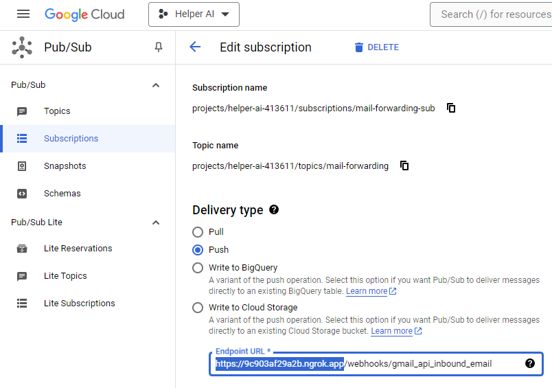
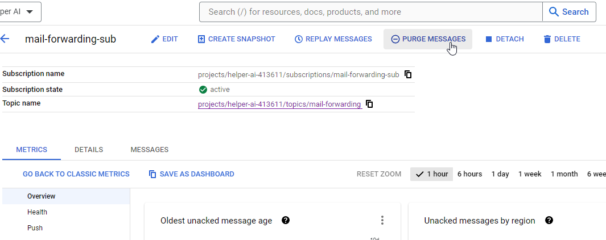
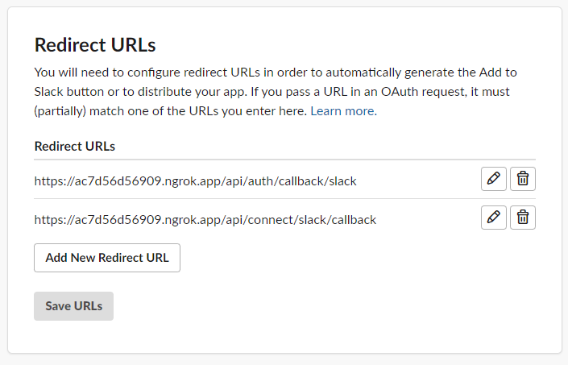
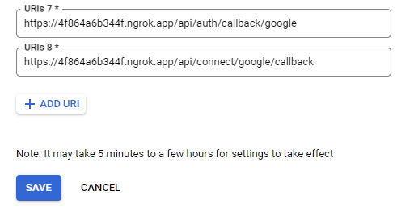

# Integrations Guide

## Gmail Integration

### Test Sending/Receiving Emails with Gmail

Sending emails via Gmail will work out of the box - you can connect a Gmail account to any mailbox from /settings.

To receive incoming emails sent to the connected Gmail address, you have a couple of options:

1. To sync a single email to local:

   - Send the email to a Gmail account you've connected.
   - Find the event(s) with the right timestamp on the [Inngest event logs](https://app.inngest.com/env/production/events/gmail%2Fwebhook.received%2Fdev/logs). If there are multiple events around the same time pick the first one since that'll contain the `messagesAdded` event.
     - If unsure which is the right event, base64-decode the `data.body.message.data` field and you'll see which address the email was sent to.
   - Copy the `data` from Inngest and paste it into the `handle-gmail-webhook-event` function's "Invoke" dialog on your [local Inngest](http://localhost:8288/functions).
   - Note the sync will only work for a short amount of time after sending the email since the authorization token will expire.

2. To listen to emails locally:
   - Ensure that no one else is testing receiving Gmail messages at the same time (since the subscription can only point to one Ngrok URL at a time, and emails sent to the configured Gmail address from someone else's local mailbox will likely not correspond to a GmailSupportEmail record in your local database).
   - Run `ngrok http 3010` in a separate terminal.
   - Copy/paste that Ngrok URL into the Endpoint URL field on the Google Cloud pub/sub subscription configured for local development (called `mail-forwarding-sub-dev`).

Once you've ensured no one else is using the pub/sub subscription, it may also be helpful to "Purge Messages" on the subscription to ensure that you do not receive outdated messages from when someone else was using the subscription.

After doing this, you can now send an email to the connected Gmail address, and you should see that email eventually appear in your configured mailbox.

Keep in mind that, while no one else will be receiving these Gmail webhook events, they may still be sending them - anyone who connects a Gmail account to their local mailbox will subscribe their Gmail account to the development subscription, so you may receive email events that silently short-circuit (because you likely don't have a corresponding GmailSupportEmail record in your local database).

If this makes local development difficult (by cluttering the Inngest event log), you can:

1. Create a new development-only Google pub/sub topic
2. Update `GOOGLE_PUBSUB_TOPIC_NAME` in `packages/nextjs/.env.local` to point to that new topic
3. Within that new topic, create a new subscription using the same configuration as the existing `mail-forwarding-sub` subscription. Set the endpoint URL to your Ngrok URL.

## Slack Integration

1. Run `ngrok http 3010` and copy/paste that Ngrok URL into the Redirect URLs section of your Slack app. The first redirect URL is for Slack login. The second URL is for connecting Slack to a given mailbox (e.g. from the "Connect to Slack" button in /settings)

2. Update `SLACK_CLIENT_ID`, `SLACK_CLIENT_SECRET`, and `SLACK_SIGNING_SECRET` in `packages/nextjs/.env.local` to the credentials for your Slack app.

3. Set `AUTH_URL` in `packages/nextjs/.env.local` to the Ngrok URL configured above e.g. `AUTH_URL=https://1jdkfiro39f8.ngrok.app`. This is so that Slack login works properly.

4. Run `bin/dev`, and access the application using that same Ngrok URL (in other words, things will not work if you access the application with `helperai.dev`. You must use the Ngrok URL configured above).

Note that if you want to login with Google while using that Ngrok URL, you will also need to update the redirect URLs in your Google Cloud Platform credentials.

## Stripe Integration

To test the Stripe webhook, you can follow the documentation instructions [here](https://docs.stripe.com/payments/handling-payment-events). After installing everything, you can test creating/cancelling subscriptions from the settings page after running `stripe listen --forward-to https://helperai.dev/api/webhooks/stripe` in a separate terminal — be sure to replace the `STRIPE_WEBHOOK_SECRET` environment variable with the value provided by that command.
